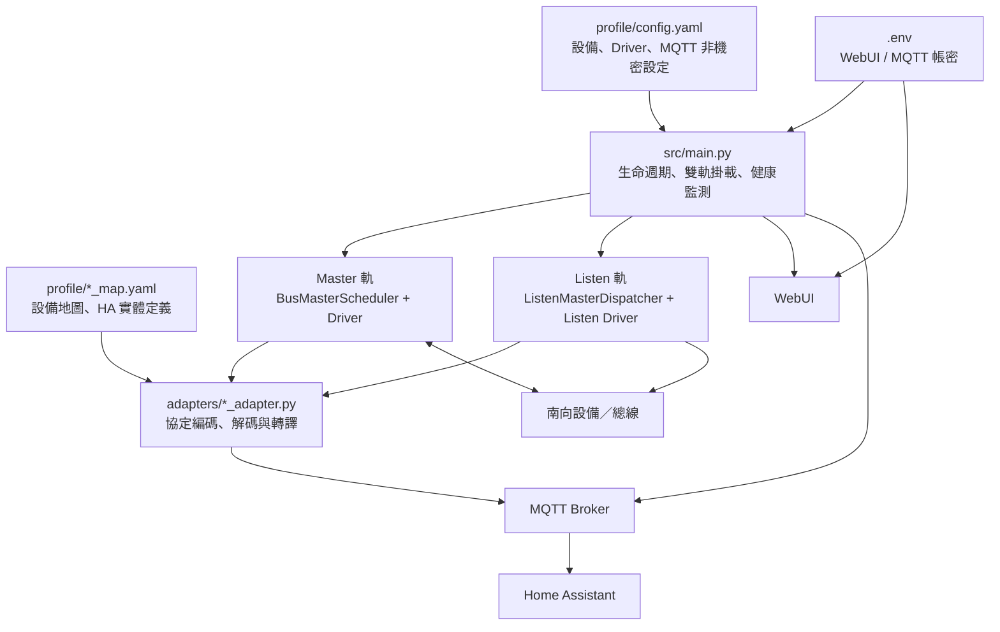

# py_ginlong 工業 IoT Gateway

這是一個以 Python／asyncio 實作的工業網關：向南連接 Modbus RTU、TCP→RS485 Gateway、USB Serial 或**非標準**的被動資料流；向北以 MQTT 對接 Home Assistant（HA），並提供受帳密保護的 WebUI。

本專案處理的是實體設備。請先在安全環境驗證 profile、UID、暫存器位址與寫入行為，再連接現場設備。

## 架構總覽



### 分層責任

| 層 | 位置 | 責任 |
|---|---|---|
| 啟動與編排 | `src/main.py` | 載入設定、建立 MQTT／WebUI、掛載設備到 Master 或 Listen、發布 health。 |
| 通訊 Driver | `src/driver.py`、`src/listen_driver.py`、`src/local_serial_driver.py` | TCP／RS485 Gateway／Serial 的連線、讀寫、斷線與重連；不負責設備欄位意義。 |
| 主動調度 | `src/bus_master.py` | 單一總線上的輪詢、寫入、回讀驗證、重試與 online/offline 狀態。 |
| 被動調度 | `src/listen_master.py` | 將持續收到的 raw byte stream 派給監聽 adapter、做 diff 發布與離線判定。 |
| 協定轉譯 | `adapters/*_adapter.py` | 產生 request、切包、驗證、解碼為鍵值資料；只有頂層 `*_adapter.py` 會被自動發現。 |
| 設備／HA 地圖 | `profile/*.yaml` | Modbus command、sensor offset、縮放、設定與 HA Discovery 定義。 |
| 北向發布 | `src/mqtt_client.py`、`src/ha_manager.py` | MQTT 連線、Discovery、state、availability 與重連後重發。 |
| 管理介面 | `src/web_admin.py`、`src/index.html` | WebUI 設定編輯、備份／還原、traffic 與 sniffer 操作。 |

## `.env`：只放秘密

請從範本建立本機 `.env`：

```bash
cp .env.example .env
```

必填欄位：

```dotenv
WEB_USER=你的WebUI帳號
WEB_PASS=強密碼
MQTT_USERNAME=MQTT帳號
MQTT_PASSWORD=強密碼
```

`.env` 已被 Git 忽略，且由 `docker-compose.yaml` 的 `env_file` 注入容器。不要把帳密寫入：

- `profile/config.yaml`
- `profile/config.yaml.bak`
- `docker-compose.yaml`
- adapter、Python 原始碼或 Git commit

`WEB_PORT` 可作為環境變數指定 WebUI port；目前 Compose 固定注入 `WEB_PORT=8001`。WebUI 啟動時會要求 `WEB_USER`／`WEB_PASS`，主程式啟動時會要求 `MQTT_USERNAME`／`MQTT_PASSWORD`；缺少任何一組都不是匿名降級，而是明確失敗。

## Master：標準主動輪詢軌

`mode: active` 是網關作為 **Modbus Master** 的路徑。它會主動送出 request，等待本次 response，再發佈資料或執行寫入回讀驗證。

```text
profile read_commands / settings
  → adapter.build_poll_read() / encode_write()
  → BusMasterScheduler
  → Driver（TCP→RS485、原生 TCP 或 USB）
  → 設備 response raw bytes
  → adapter.decode()
  → HA Manager
  → MQTT state / availability / Discovery
```

範例：

```yaml
driver:
  type: tcp        # TCP→RS485 Gateway；不是 Modbus TCP 封包
  host: 192.168.1.10
  port: 502
  timeout: 1
  inter_frame_delay: 0.35

devices:
  - uid: 1
    adapter: rtu
    profile: solis_inverter_map
    mode: active
    poll_interval: 15
```

### Master 的邊界

- `driver.type: rtu` 或 `tcp` 依目前 Driver factory 使用 TCP socket；`rtu` 是 RTU bytes 經 TCP→RS485 Gateway，`tcp` 為 `AsyncModbusTcpDriver`。
- `driver.type: usb` 使用本機序列埠。
- 主動設備 UID 必須是正整數，且在所有 active／listen 設備中全域唯一。
- 寫入會由 `BusMasterScheduler` 排程，不應繞過 WebUI／MQTT 控制流程直接對現場設備送 bytes。
- Master 收包與 CRC／Exception 的已知審查結果見 [Master RTU 審查報告](report/018_Master_Modbus_RTU_唯讀審查.md)。

## Listen：非標準被動旁聽軌

`mode: listen` **不是通用 Modbus Master/Slave 實作**，也不會主動對總線發 request。它用於已有其他主站或設備持續輸出資料，而本網關僅讀取 raw byte stream 的情境。

```text
外部設備／既有主站持續傳送 bytes
  → Listen Driver.read_stream()
  → ListenMasterDispatcher
  → 對各監聽 adapter 呼叫 feed(chunk)
  → adapter 自行切包／解碼
  → 只在資料實質變更時發佈 MQTT
```

這條軌道的協定完整性由各 adapter 的 `feed()` 決定。例如 JKBMS adapter 會辨識其專用的 `55 AA EB 90` 原生幀，也會觀察混線上的 Modbus `0x10` 寫入；這不是可套用到所有設備的標準 Modbus 解碼器。

設定 Listen 時必須額外提供 `listen_driver`：

```yaml
listen_driver:
  type: tcp        # 或 usb
  host: 192.168.1.20
  port: 9000

devices:
  - uid: 0
    adapter: jkbms
    profile: jkbms_map
    mode: listen
```

重要限制：

- **禁止** active 的 `driver` 與 `listen_driver` 共用同一 TCP port；主程式會拒絕啟動，避免實體碰撞。
- Listen adapter 必須實作 `feed()`；active adapter 則需要 `build_poll_read()`、`build_verify_read()`、`encode_write()`、`decode()`。
- Listen 首次連線失敗不會使整個網關退出：WebUI、MQTT 與 health 保持運作，監聽 Driver 依退避機制重連，第一個有效幀才恢復設備 online。
- 監聽解碼超時有保險絲與鎖定機制；這是為了避免壞 adapter 長期耗盡 worker，不代表它能修復外部總線或設備韌體問題。

## 設定、Profile 與救援模式

`profile/config.yaml` 是可由 WebUI 修改的非機密執行設定；每個設備的 profile 位於 `profile/*_map.yaml`。

修改 profile 後先驗證：

```bash
docker exec ginlong python /app/src/map_validator.py /app/profile/solis_inverter_map.yaml
```

若 active Driver 無法連線，主程式會退出，WebUI 也會跟著停止。需要以 WebUI 搶修時，可先在 host 上將 `profile/config.yaml` 的 `devices:` 清空，再重啟容器；此時會進入「純 WebUI 救援模式」，不建立通訊 Driver，但 WebUI、MQTT 與 health 仍運作。

WebUI 的設定寫入、備份與還原使用鎖與原子替換；不要手動刪除 `profile/config.yaml.lock`，也不要修改 `config.yaml.bak`。

## Docker 部署與日常操作

```bash
# 首次或停止後啟動
./up.sh

# 修改已 bind-mount 的 src/、adapters/、profile/ 後重啟容器
./restart.sh

# 修改 Dockerfile 或 requirements.txt 後無快取重建
./build.sh

# 追蹤日誌
./log.sh

# 進入容器
./it.sh

# 停止
./down.sh
```

Compose 掛載規則：

- `src/`、`adapters/`：唯讀掛入容器；在 host 修改後以 `./restart.sh` 載入。
- `profile/`：可讀寫掛入容器；WebUI 的設定變更會寫回 host。
- 使用 `network_mode: host`，請在部署前確認 OT 網段、Firewall 與 port 衝突。

容器名稱為 `ginlong`，故排障通常從以下開始：

```bash
docker logs -f ginlong
docker ps --filter name=ginlong
```

## 可觀測性與排障順序

1. 先看 `docker logs -f ginlong`：啟動、Driver、輪詢、重連、profile 隔離與解析錯誤都在此。
2. 確認 MQTT 的 gateway status、health、每台 device availability 是否一致。
3. 於 WebUI 查看 traffic／設定；不要因為旁聽資料異常就直接對總線發測試寫入。
4. Master 問題先檢查 request／response、UID、FC、ByteCount、CRC、profile offset；Listen 問題則保留 raw stream 與對應 adapter 版本。
5. 對 USB／RS485 先確認裝置路徑、權限、baudrate、接地與終端電阻，再判斷為軟體解碼問題。

## 開發約定

- runtime code 在 `src/`；adapter 檔名必須是 `*_adapter.py`，且定義 `ADAPTER_NAME` 與 `Adapter`。
- `scratch/` 是調查／隔離測試區，不是 production runtime。
- `report/` 是審查與施工紀錄，不會被容器執行。
- 對 live OT 修改前，保留原始資料、驗證 profile，並以最小變更優先。
